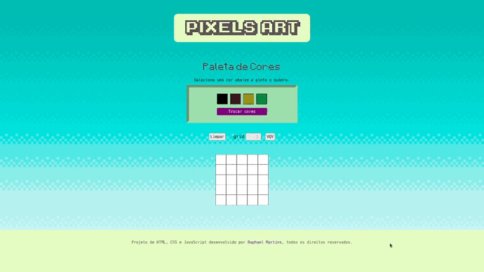
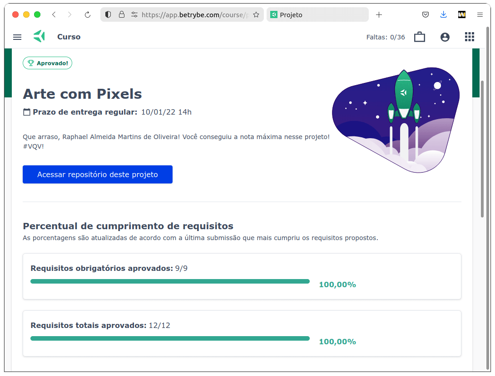

<small>(for the English version, <a href="#en">click here</a>)</small>

# Pixels Art
<h2>:brazil: Português</h2>

Projeto de HTML, CSS e JavaScript desenvolvido por mim (<a href="https://www.linkedin.com/in/raphaelameidamartins/" target="_blank" rel="external">Raphael Martins</a>) ao final do Bloco 5 do Módulo 1 do curso de Desenvolvimento Web da <a href="https://www.betrybe.com" targe="_blank" rel="nofollow">Trybe</a>. Obtive aprovação com 100% dos requisitos obrigatórios e opcionais atingidos, e seguindo as todas as regras de padronização do código e boas práticas do Linter.

O projeto consistiu no desenvolvimento de uma página web dinâmica e interativa em que o usuário pode pintar os pixels em um quadro utilizando uma paleta de cores gerada de forma aleatória, e também alterar o tamanho do quadro.

<a href="https://raphaelalmeidamartins.github.io/project-pixels-art/" target="_blank">Clique aqui</a> para conferir o resultado do projeto no navegador.

### Requisitos
<ol>
  <li>Adicione à página o título "Paleta de Cores".
    <ul>
      <li>O título deverá ficar dentro de uma tag <code>h1</code> com o <code>id</code> denominado <code>title</code>;</li>
      <li>O texto do título deve ser <strong>exatamente</strong> "Paleta de Cores".</li>
    </ul>
  </li>
  <li>Adicione à página uma paleta contendo quatro cores distintas.
    <ul>
      <li>A paleta de cores deve ser um elemento com <code>id</code> denominado <code>color-palette</code>, ao passo que cada cor individual contida na paleta de cores deve possuir a <code>classe</code> <code>color</code>;</li>
      <li>A cor de fundo de cada elemento da paleta deverá ser a cor que o elemento representa. <strong>A única cor não permitida na paleta é a cor branca.;</strong></li>
      <li>Cada elemento da paleta de cores deverá ter uma borda preta, sólida e com 1 pixel de largura;</li>
      <li>A paleta de cores deverá listar todas as cores disponíveis para utilização lado a lado, e deverá ser posicionada abaixo do título "Paleta de Cores";</li>
      <li>A paleta de cores não deve conter cores repetidas.</li>
    </ul>
  </li>
  <li>Adicione a cor preta como a primeira cor da paleta de cores.</li>
  <li>Adicione à página um quadro de pixels, com 25 pixels.
    <ul>
      <li>O quadro de "pixels" deve ter 5 elementos de largura e 5 elementos de comprimento;</li>
      <li>O quadro de "pixels" deve possuir o <code>id</code> denominado <code>pixel-board</code>, ao passo que cada "pixel" individual dentro do quadro deve possuir a <code>classe</code> denominada <code>pixel</code>;</li>
      <li>A cor inicial dos "pixels" dentro do quadro, ao abrir a página, deve ser branca;</li>
      <li>O quadro de "pixels" deve aparecer abaixo da paleta de cores.</li>
    </ul>
  </li>
  <li>Faça com que cada elemento do quadro de pixels possua 40 pixels de largura, 40 pixels de altura e seja delimitado por uma borda preta de 1 pixel.</li>
  <li>Defina a cor preta como cor inicial. Ao carregar a página, a cor preta já deve estar selecionada para pintar os pixels
    <ul>
      <li>O elemento da cor preta deve possuir, inicialmente, a <code>classe</code> <code>selected</code>;</li>
      <li>Note que o elemento que deverá receber a classe <code>selected</code> deve ser um dos elementos que possuem a classe <code>color</code>, como especificado no <strong>requisito 2</strong>.</li>
    </ul>
  </li>
  <li>Clicar em uma das cores da paleta faz com que ela seja selecionada e utilizada para preencher os pixels no quadro.
    <ul>
      <li>A <code>classe</code> <code>selected</code> deve ser adicionada à cor selecionada na paleta, ao mesmo tempo em que é removida da cor anteriormente selecionada;</li>
      <li>Somente uma das cores da paleta deve ter a <code>classe</code> <code>selected</code> de cada vez;</li>
      <li>Note que os elementos que deverão receber a classe <code>selected</code> devem ser os mesmos elementos que possuem a classe <code>color</code>, como especificado no requisito 2.</li>
    </ul>
  </li>
  <li>Clicar em um pixel dentro do quadro após selecionar uma cor na paleta faz com que o pixel seja preenchido com a cor selecionada.</li>
  <li>Crie um botão que, ao ser clicado, limpa o quadro preenchendo a cor de todos seus pixels com branco.</li>
</ol>

### Bônus
<ol start="10">
  <li>Faça o quadro de pixels ter seu tamanho definido pela pessoa usuária.
    <ul>
      <li>Crie um input e um botão que permitam definir um quadro de pixels com tamanho entre 5 e 50. Ao clicar no botão, deve ser gerado um quadro de <strong>N</strong> pixels de largura e <strong>N</strong> pixels de altura, onde <strong>N</strong> é o número inserido no input;</li>
      <li>Ou seja, se o valor passado para o input for 7, ao clicar no botão, vai ser gerado um quadro de 49 pixels (7 pixels de largura x 7 pixels de altura);</li>
      <li>O input deve ter o <code>id</code> denominado <code>board-size</code> e o botão deve ter o <code>id</code> denominado <code>generate-board</code>;</li>
      <li>O input só deve aceitar números maiores que zero. Essa restrição deve ser feita usando os atributos do elemento <code>input</code>;</li>
      <li>O botão deve conter o texto "VQV";</li>
      <li>O input deve estar posicionado entre a paleta de cores e o quadro de pixels;</li>
      <li>O botão deve estar posicionado ao lado do input;</li>
      <li>Se nenhum valor for colocado no input ao clicar no botão, mostre um <code>alert</code> com o texto: "Board inválido!";</li>
      <li>O novo quadro deve ter todos os pixels preenchidos com a cor branca.</li>
    </ul>
  </li>
  <li>Limite o tamanho mínimo e máximo do board.
    <ul>
      <li>Caso o valor digitado no input <code>board-size</code> fuja do intervalo de 5 a 50, faça:</li>
        <ul>
          <li>Valor menor que 5, considerar 5 como padrão;</li>
          <li>Valor maior que 50, considerar 50 como padrão.</li>
        </ul>
    </ul>
  </li>
  <li>Faça com que as cores da paleta sejam geradas aleatoriamente ao carregar a página.
    <ul>
      <li>A cor preta ainda precisa estar presente e deve ser a primeira na sua paleta de cores.</li>
    </ul>
  </li>
</ol>
 

<h2 id="en">:us: English</h2>

Project of HTML, CSS and JavaScript develop by me (<a href="https://www.linkedin.com/in/raphaelameidamartins/" target="_blank" rel="external">Raphael Martins</a>) in the end of the Unit 5 Module 1 of the Web Development course at <a href="https://www.betrybe.com" targe="_blank" rel="nofollow">Trybe</a>. I was approved with 100% of the mandatory and optional requirements met, and following all the Linter rules of best practices and code standardization.

We had to develop a dynamic and interactive web page that the user can paint the pixels on a board using a palette of colors generated randomly. The user can also change the size of the board.

<a href="https://raphaelalmeidamartins.github.io/project-pixels-art/" target="_blank">Click here</a> to check out the final version of the project on your browser.

### Requirements
<ol>
  <li>Add to your page the title "Paleta de Cores" (<em>"Color Palette"</em>).
    <ul>
      <li>The title should be in a tag <code>h1</code> with <code>title</code> as the <code>id</code>;</li>
      <li>The text of the title <strong>must be</strong> "Paleta de Cores" (<em>"Color Palette"</em>).</li>
    </ul>
  </li>
  <li>Add a palette to your page containing four different colors.
    <ul>
      <li>I needs to be an element with <code>color-palette</code> as the <code>id</code>, and each individual colors should have the <code>class</code> <code>color</code>;</li>
      <li>The background color of each element in the palette should be the color that the elements represent. <strong>The only forbidden color is white;</strong></li>
      <li>Each element of the color palette should have a 1 pixel solid black border;</li>
      <li>The color palette should be positioned below the title and the colors inside the palette should be positioned side by side;</li>
      <li>The palette must not contain repeated colors.</li>
    </ul>
  </li>
  <li>Add black as the first color of the palette.</li>
  <li>Add to your page a pixels board with 25 pixels.
    <ul>
      <li>It should have 5 elements of width and 5 elements of height;</li>
      <li>The board needs to have <code>pixel-board</code> as its <code>id</code>, and each individual "pixel"inside the board should have the <code>class</code> <code>pixel</code>;</li>
      <li>The initial color of the "pixels" inside the board on loading the page needs to be white;</li>
      <li>The board should be positioned below the color palette.</li>
    </ul>
  </li>
  <li>Each element of the board should have 40 pixels of width and height, and needs to have a 1 pixel solid black border.</li>
  <li>Define the black color as default. I should be already selected on loading the page.
    <ul>
      <li>The element of the black color should initally have the<code>class</code> <code>selected</code>;</li>
      <li>Only the elements that have the <code>class</code> <code>color</code> should be able to get the <code>class</code> <code>selected</code>.</li>
    </ul>
  </li>
  <li>On clicking in of the colors of the palette, the user should be able to paint the "pixels" of the board with the selected color.
    <ul>
      <li>The class <code>selected</code> should be added the the colors clicked, and at the same time removed from the previously selected color;</li>
      <li>Only one of the colors in the palette can have the class <code>selected</code> per time;</li>
      <li>Only the elements that have the <code>class</code> <code>color</code> should be able to get the <code>class</code> <code>selected</code>.</li>
    </ul>
  </li>
  <li>On clicking in a "pixel" on the board, its background should be filled with the selected color.</li>
  <li>Add a button that when clicked, clean the board and make all the "pixels" have white as background color.</li>
</ol>

### Bonus
<ol start="10">

</ol>
